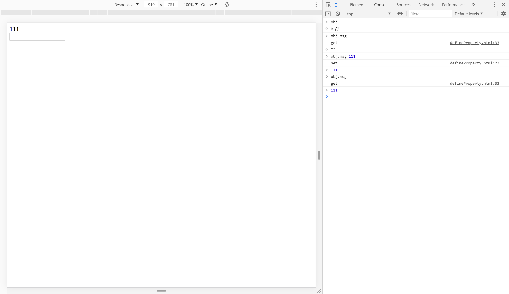
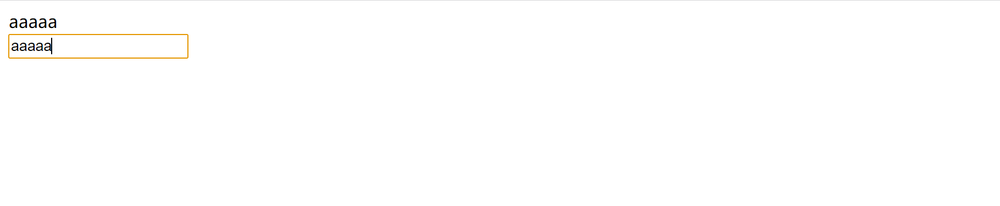
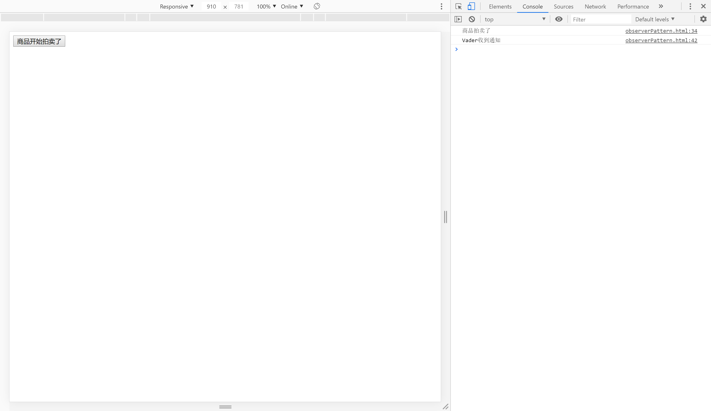

<div  align="center">    
    
</div>

   [](https://codebeat.co/projects/github-com-aituring-yoda-master) 


<center><h1><font color="rgb(167, 200, 34)">Yoda</font></h1></center>


yoda是一个为了学习Vue原理，按照Vue语法制作的简易的MVVM框架。


## 🌏MVVM

### 什么是MVVM

MVVM是Model-View—ViewModel的简称。

- Model：模型层，负责处理业务逻辑以及和服务器端进行交互
- View：视图层：负责将数据模型转化为UI展示出来，可以简单的理解为HTML页面
- ViewModel：视图模型层，用来连接Model和View，是Model和View之间的通信桥梁

在MVVM的架构下，View层和Model层并没有直接联系，而是通过ViewModel层进行交互。 ViewModel层通过双向数据绑定将View层和Model层连接了起来，使得View层和Model层的同步工作完全是自动的。
因此开发者只需关注业务逻辑，无需手动操作DOM。

如图：


### Vue与jQuery

Vue就是一个典型的MVVM框架。Vue就相当于MVVM中的ViewModel层。

在Vue之前，我们一般用jQuery操作DOM元素。下面是一个添加button并绑定click事件的例子：

```html
<!DOCTYPE html>
<html>
	<head>
		<meta charset="UTF-8">
		<title></title>
		<script type="text/javascript" src="js/jquery-1.11.0.js"></script>
		<script type="text/javascript">
			  $(function(){
			  	   $("#a").click(function(){			  	   			 
			  	    alert("click");
			  	   });			  			 		  				  	
			  });
			 
		</script>
	</head>
	<body>
		<input type="button" value="abutton" id="a" />
    </body>
   </html> 
```
可以看到，HTML和javascript代码耦合在了一起。如果直接作DOM元素，会造成性能低下等一系列问题。

如果使用Vue的话，可以将视图层和模型层有效地分离开来，代码如下：

```vue
<template>
   <div>
     <button @click="handeClick()">点我</button>
   </div>
</template>
<script>
export default {
   name:'App',
   methods:{
     handleClick:function(){
       console.log('click');
     }
   },
}
</script>
```
可以看到，在Vue中，负责视图的 HTML 代码和负责业务逻辑的 JS 代码有效地分离开来。之所以能做到这一点，这就要依靠MVVM中的VM(ViewModel)实现。ViewModel层通过双向数据绑定将View层和Model层连接了起来，使得View层和Model层的同步工作完全是自动的。

## 🐱‍💻编写类Vue的框架Yoda

### 框架的核心要素/模块

#### 响应式

##### 1️⃣数据的双向绑定
实现数据和页面两者之中有一者发生改变，另一者也随之改变。
通过数据劫持实现。下面是一个数据劫持的案例：

```html
<body>
	<div id="app"></div>
	<input type="text" id="input">
	<script>
		// 定义一个空的obj对象
		var obj = {};
		// 定义一个空数据
		var value = "";
		/**
		 * 一般使用Object.defineProperty进行数据劫持
		 * Object.defineProperty()方法直接在对象上定义一个新属性，或修改对象的现有属性，并返回此对象。
		 * 给obj添加一个名为msg的属性
		 * 该函数接受三个参数 
		 * 1.一个对象
		 * 2. 该对象设置的属性名
		 * 3. 一个配置对象，可以配置该属性的set/get方法
		 * */
		Object.defineProperty(obj,"msg",{
			set:function(newValue){
				console.log("set");
				// 数据发生变动时，需要重新渲染虚拟DOM
				document.querySelector("#app").innerHTML = newValue;
				value = newValue;
			},
			get:function(){
				console.log("get");
				return value;
			}
		});

		// 监听input事件，但发生变化时，重新设置obj的msg属性，触发set函数，则view自动更新
		document.querySelector("#input").addEventListener("input",function(e){
			obj.msg = e.target.value;
		});
	
	</script>
</body>
```
这是运行的结果：



可以看到`defineProperty()`函数在将`obj.msg`赋值给value时，劫持到value的值，并把它插入到`<div id="app">`中。之后还设置了一个监听事件，当input变化时，`obj.msg`的值就边成value。这样就实现了数据的双向绑定，和vue一模一样。



##### 2️⃣观察者模式(发布订阅模式)

当对象间存在一对多关系时，则使用观察者模式（Observer Pattern）。比如，当一个对象被修改时，则会自动通知它的依赖对象。观察者模式属于行为型模式。


- 主要解决：一个对象状态改变给其他对象通知的问题，而且要考虑到易用和低耦合，保证高度的协作。

- 何时使用：一个对象（目标对象）的状态发生改变，所有的依赖对象（观察者对象）都将得到通知，进行广播通知。

- 如何解决：使用面向对象技术，可以将这种依赖关系弱化。

- 关键代码：在抽象类里有一个 ArrayList 存放观察者们。

- 应用实例： 1、拍卖的时候，拍卖师观察最高标价，然后通知给其他竞价者竞价。

下面是一个简单的实例：

```html
<!DOCTYPE html>
<html lang="en">
<head>
    <meta charset="UTF-8">
    <meta name="viewport" content="width=device-width, initial-scale=1.0">
    <title>Document</title>
</head>
<body>
    <button onclick="sell()">商品开始拍卖了</button>
    <script>
        /**
         * 定义一个事件处理中心
         * 该对象包含subs的数组，存放需要遍历执行的函数
         * 相当于客户名册，但需要一个提供添加和通知的功能
         * */
        function EventHandle(){
            var subs = [];
            // 添加需要执行的函数
            this.addSub = function(sub){
                sub && subs.push(sub);
            };
            // 遍历通知
            this.notify = function(){
                subs.forEach(function(sub){
                    sub.update();
                });
            };
        }

        // 实例化
        var ev = new EventHandle();
        // 发布者发布消息
        function sell(){
            console.log("商品拍卖了");
            ev.notify();
        }
        // 订阅者
        (function man(){
            var myName="Vader";
            ev.addSub({
                update:function(){
                    console.log(myName+"收到通知");
                }
            });
        })();
    </script>
</body>
</html>
```
下面是运行效果：




#### 模板解析
把vue语法解析为html代码，参照vue1.x
vue2.x增加了虚拟DOM
#### 虚拟DOM

### 框架的完整流程


